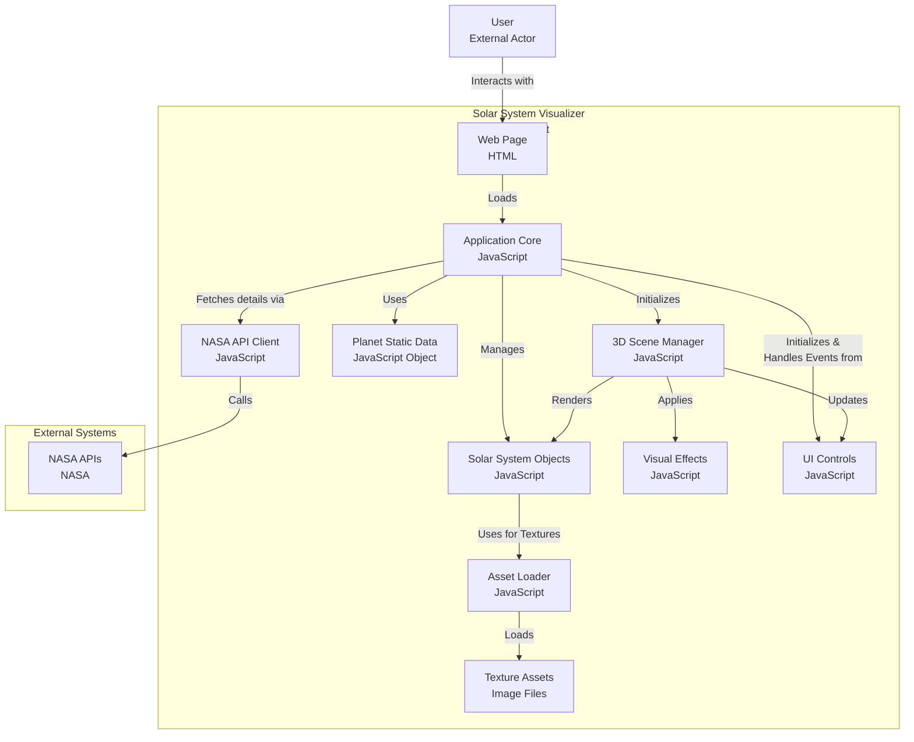

# 🌌 Solar System Dashboard

An immersive, interactive 3D solar system visualization with a modern, responsive UI. Experience the wonders of our solar system through an engaging and educational interface.


## 📋 System Context

### Directory Structure
```
Kunal.Pandey_frontend_assignment
├── public
│   └── textures
│       ├── earth_bump.jpeg
│       ├── earth_clouds.jpg
│       ├── earth_specular.jpg
│       ├── earth.jpg
│       ├── jupiter.jpg
│       ├── mars_bump.jpg
│       ├── mars.jpg
│       ├── mercury.jpg
│       ├── moon.jpg
│       ├── neptune.jpg
│       ├── saturn_rings.png
│       ├── saturn.jpg
│       ├── sun.jpg
│       ├── uranus.jpg
│       ├── venus_atmosphere.png
│       └── venus_surface.jpg
├── src
│   ├── js
│   │   ├── effects
│   │   │   └── starField.js
│   │   ├── objects
│   │   │   ├── orbit.js
│   │   │   └── planet.js
│   │   ├── services
│   │   │   ├── DataFetcher.js
│   │   │   └── nasaAPI.js
│   │   ├── ui
│   │   │   └── UI.js
│   │   ├── utils
│   │   │   └── LoadingManager.js
│   │   ├── main.js
│   │   ├── planetData.js
│   │   └── scene.js
│   ├── styles
│   │   └── main.scss
│   └── index.html
├── download-textures.js
├── index.html
├── package-lock.json
├── package.json
├── README.md
└── vite.config.js
```

### System Architecture


## ✨ Features

- Interactive 3D solar system visualization
- Modern UI with dark/light mode
- Responsive design for all devices
- Planet information cards
- Simulation speed control
- Beautiful star field background
- Orbit visualization
- Planet selection and camera focus

### 🔗 NASA API Integration

This project includes code for integrating NASA and Solar System APIs to fetch real-time planetary data and space imagery. 

**Purpose:**
- Fetches up-to-date planet statistics (mass, volume, gravity, etc.)
- Retrieves Earth and space images (EPIC, APOD)
- Enables dynamic, data-driven visualization

**Where is it used?**
- `src/js/services/nasaAPI.js` — Main NASA API service (functions: `getPlanetData`, `getEarthData`, `getSunData`)
- `src/js/services/DataFetcher.js` — Additional data/image fetching (functions: `fetchPlanetData`, `fetchEarthImage`, `fetchHubbleImage`)

**Current Status:**
- The code is scaffolded and ready for use. To activate, add your NASA API key to a `.env` file as described in the Setup section.
- If no API key is provided, the app will use static or fallback data.

**Example Usage:**
```js
import { nasaAPI } from './services/nasaAPI';
const marsData = await nasaAPI.getPlanetData('mars');
```

## 🚀 Getting Started

### Prerequisites
- Node.js (v14.0.0 or higher)
- npm or yarn

### Installation

1. Clone the repository
```bash
git clone https://github.com/yourusername/solar-system-dashboard.git
cd solar-system-dashboard
```

2. Install dependencies
```bash
npm install
# or
yarn install
```

3. Start the development server
```bash
npm run dev
# or
yarn dev
```

4. Open your browser and navigate to `http://localhost:5173`

## 🛠️ Built With

- [Three.js](https://threejs.org/) - 3D graphics library
- [Vite](https://vitejs.dev/) - Next Generation Frontend Tooling
- [GSAP](https://greensock.com/gsap/) - Animation library
- [SASS](https://sass-lang.com/) - CSS preprocessor
- [Axios](https://axios-http.com/) - HTTP client
- [dat.GUI](https://github.com/dataarts/dat.gui) - Debug interface

## 🚀 NASA API Integration

The project integrates with multiple NASA APIs to provide real-time space data and imagery:

### APIs Used
1. **NASA Solar System API**
   - Endpoint: `api.le-systeme-solaire.net`
   - Purpose: Fetches detailed planetary data
   - Data includes: mass, volume, density, gravity, radius, temperature

2. **NASA EPIC API**
   - Endpoint: `api.nasa.gov/EPIC/api`
   - Purpose: Retrieves Earth Polychromatic Imaging Camera (EPIC) images
   - Provides: Latest Earth images from space

3. **NASA APOD API**
   - Endpoint: `api.nasa.gov/planetary/apod`
   - Purpose: Fetches Astronomy Picture of the Day
   - Provides: High-quality space images from Hubble and other sources

### Implementation Details
```javascript
// NASA API Service Structure
class NasaAPI {
    constructor() {
        this.apiKey = import.meta.env.VITE_NASA_API_KEY;
        this.baseURL = 'https://api.nasa.gov';
        this.solarSystemURL = 'https://api.le-systeme-solaire.net/rest/bodies';
    }

    // Methods for fetching different types of data
    async getEarthData() { ... }
    async getSunData() { ... }
    async getPlanetData(planetName) { ... }
}
```

### Features Enabled by NASA API
1. **Real-time Planetary Data**
   - Accurate planet sizes and distances
   - Current orbital positions
   - Rotation periods
   - Physical characteristics

2. **Dynamic Earth Visualization**
   - Real-time Earth rotation
   - Current Earth images from space
   - Atmospheric conditions

3. **Space Imagery**
   - High-resolution planet textures
   - Latest space photographs
   - Historical space images

### Setup Instructions
1. Get your NASA API key from [api.nasa.gov](https://api.nasa.gov/)
2. Create a `.env` file in the project root:
   ```env
   VITE_NASA_API_KEY=your_api_key_here
   ```
3. Restart the development server

### API Usage Examples
```javascript
// Fetching planet data
const planetData = await nasaAPI.getPlanetData('mars');

// Getting Earth images
const earthImage = await dataFetcher.fetchEarthImage();

// Retrieving Hubble images
const hubbleImage = await dataFetcher.fetchHubbleImage();
```

## 📱 UI Components

### Side Panel
- Planet selection menu
- Theme toggle
- Simulation controls
- Speed adjustment slider

### Main View
- Interactive 3D canvas
- Planet information cards
- Camera controls
- Orbital paths

### Information Cards
- Planet name and type
- Physical characteristics
- Orbital data
- Interesting facts

## 🎨 Design System

### Colors
- Primary: `#2196F3`
- Secondary: `#FF4081`
- Background (Light): `#FFFFFF`
- Background (Dark): `#121212`
- Text (Light): `#333333`
- Text (Dark): `#FFFFFF`

### Typography
- Font Family: Inter
- Headings: 600 weight
- Body: 400 weight
- Monospace: JetBrains Mono

### Spacing
- Base unit: 8px
- Container padding: 24px
- Component spacing: 16px

## 🔧 Configuration

The project can be configured through the following files:
- `vite.config.js` - Build configuration
- `src/js/planetData.js` - Planet data and settings
- `src/styles/main.scss` - Global styles and variables

## 📦 Project Structure

```
├── src/
│   ├── js/
│   │   ├── main.js
│   │   ├── planetData.js
│   │   ├── scene.js
│   │   ├── services/
│   │   ├── utils/
│   │   ├── ui/
│   │   ├── objects/
│   │   └── effects/
│   └── styles/
│       └── main.scss
├── public/
├── index.html
└── vite.config.js
```

## 🤝 Contributing

1. Fork the repository
2. Create your feature branch (`git checkout -b feature/AmazingFeature`)
3. Commit your changes (`git commit -m 'Add some AmazingFeature'`)
4. Push to the branch (`git push origin feature/AmazingFeature`)
5. Open a Pull Request

## 📝 License

This project is licensed under the MIT License - see the [LICENSE](LICENSE) file for details.

## 🙏 Acknowledgments

- NASA for planetary data
- Three.js community for 3D graphics support
- All contributors who have helped shape this project

## 📞 Contact

Your Name - [@kunal](kunalpandey0297@gmail.com)
Project Link: [@https://github.com/kunal0297/Kunal.Pandey_frontend_assignment](@https://github.com/kunal0297/Kunal.Pandey_frontend_assignment )
